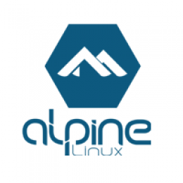

[![MIT License][license-shield]][license-url]
[![LinkedIn][linkedin-shield]][linkedin-url]

 

  

<h3 align="center">Docker Cron Dumps</h3>

  

    Alpine Cron Container running Databases Dumps.
     
    <a href="https://github.com/ricurdinola/docker-cron-dump"><strong>Explorar el repo »</strong></a>
     
     
    <a href="https://github.com/ricurdinola/docker-cron-dump/issues">Reportar un Bug </a>
    ·
    <a href="https://github.com/ricurdinola/docker-cron-dump/issues">Sugerencias </a>
  

## Sobre el Proyecto
El proyecto es un ejemplo de Crons sobre Alpine que utiliza los clientes de MySQL y MongoDB para realizar Dumps y copiar los archivos a un servidor NAS.

<a href="#top">Ir al Inicio</a>

### Descripción del Proyecto

    

El stack se compone de los siguientes elementos:

* Un contenedor basado en Alpine Linux destinado a correr Crons.
* Un cron configurado para ejecutarse todos los días a las 23:30. El archivo \cron-server\crons\root posee los comandos a ejecutar. El mismo se copia al contenedor durante su creación.
* Una carpeta /cron-server/crons/scripts donde se encuentra un script `backup` que es ejecutado por el Cron. Posee un dump de Mysql y de MongoDB. 
* Una carpeta /cron-server/crons/scripts donde se encuentra un archivo `param` de parametrizaciones, con los valores a utilizar en el script de backup.
* Un `Dockerfile` que copia los archivos dentro de los contenedores y configura una zona horaria para el contenedor.
* Un `docker-compose` que posee comentadas las instrucciones de montaje de volúmenes, las cuales pueden ser utilizadas al modificar el script y verificar su funcionamiento.

<a href="#top">Ir al Inicio</a>

## Utilizando el Stack
A continuación, se describe brevemente la utilización del proyecto.

### Pre-requisitos
Solo es necesario tener instalado el [Docker](https://www.docker.com/products/docker-desktop) y el [Docker Compose](https://docs.docker.com/compose/install/)

### Estructura de Archivos
* `/cron-server` Contiene el _Dockerfile_ del contenedor.
* `/cron-server/crons` Contiene el archivo _root_ en donde se programa las tareas programadas que se deben ejecutar.
* `/cron-server/crons/scripts` Contiene el archivo _backup_ con los ejemplos de dumps y copias a un servidor NAS externo. También posee el archivo _param_ con las configuraciones de los valores a utilizar en el script de backup.
  
### Configurar el ambiente de desarrollo
En el directorio raíz, existe un archivo .env, el cual contiene los siguientes parámetros configurados.

#### Stack Options
* `COMPOSE_PROJECT_NAME`: Es el nombre del stack de contenedores que se generarán.

#### Server Options
* `SERVER_NAME`: El nombre que le daremos al contenedor del servidor Web.

### Instalar el ambiente de desarrollo
Una vez cambiado los parámetros deseados, se debe ejecutar el archivo `build.sh`

<a href="#top">Ir al Inicio</a>

## Licencia
Distribuido bajo Licencia MIT. Para más información, ver el archivo
[LICENSE](https://github.com/ricurdinola/docker-api-gateway/blob/main/LICENSE)

<a href="#top">Ir al Inicio</a>

## Contacto
Ricardo Urdinola - ricurdinola@gmail.com - [Mis Repositorios](https://github.com/ricurdinola?tab=repositories)

<a href="#top">Ir al Inicio</a>

[license-shield]: https://img.shields.io/github/license/ricurdinola/docker-lamp-stack?style=for-the-badge

[license-url]: https://github.com/ricurdinola/docker-api-gateway/blob/main/LICENSE

[linkedin-shield]: https://img.shields.io/badge/-LinkedIn-black.svg?style=for-the-badge&logo=linkedin&colorB=555

[linkedin-url]: https://www.linkedin.com/in/urdinolaricardo/
